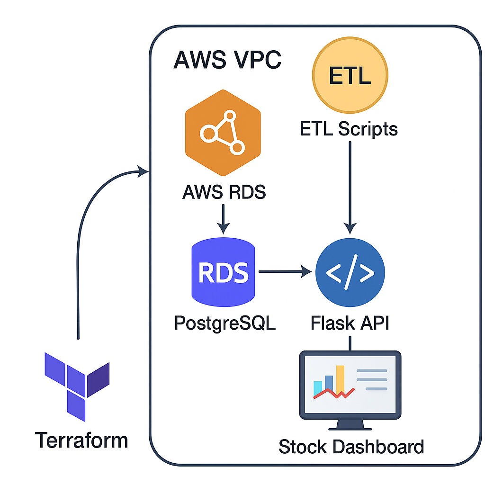

# 📈 Stock Forecasting on AWS (with Terraform, Flask, PostgreSQL, and Streamlit)

This project demonstrates an end-to-end data pipeline for historical S&P 500 stock forecasting using:

- **Terraform** for AWS infrastructure provisioning (RDS, VPC, EC2)
- **Python (Flask)** backend to fetch/store data
- **PostgreSQL RDS** as the database
- **Streamlit** frontend dashboard for visualization
- **Alpha Vantage API** for fetching historical stock data

---

## 🎯 Project Objectives

- Provision AWS infrastructure using Terraform (VPC, RDS, EC2)
- Load historical S&P 500 stock data into PostgreSQL
- Automate daily data updates via a Python script
- Visualize selected stock data using a simple UI
- Ensure infrastructure-as-code (IaC) best practices

---

## Architecture Overview




## 📁 Folder Structure

```bash
stock-forecasting-aws/
│
├── flask-server/               # Flask API to serve data
│   └── app.py
│
├── stock-app/                  # Python scripts
│   ├── fetch_sp500_history.py
│   └── daily_sp500_update.py
│
├── stock-frontend/            # Simple HTML + JS frontend
│   ├── index.html
│   └── static/
│       ├── css/styles.css
│       └── js/script.js
│
├── stock-forecast-infra/      # Terraform infra setup
│   ├── main.tf
│   ├── variables.tf
│   ├── provider.tf
│   └── terraform.tfvars       # Not committed (in .gitignore)
│
├── .env                        # For Flask DB config (in .gitignore)
├── requirements.txt
├── .gitignore
└── README.md
⚙️ Setup Instructions
1. Clone the Repository
bash
Copy
Edit
git clone https://github.com/Nasrullah-chandio/stock-forecasting-aws.git
cd stock-forecasting-aws
2. Create and Activate a Python Virtual Environment
bash
Copy
Edit
python3 -m venv venv
source venv/bin/activate      # macOS/Linux
# OR
venv\Scripts\activate         # Windows
3. Install Python Dependencies
bash
Copy
Edit
pip install -r requirements.txt
4. Add Environment Variables
Create a .env file at the root level:

ini
Copy
Edit
DB_HOST=your-rds-endpoint
DB_NAME=stocks
DB_USER=pgadmin
DB_PASSWORD=yourpassword
DB_PORT=5432
ALPHA_VANTAGE_API_KEY=your_api_key
⚠️ Note: .env is excluded from Git via .gitignore to protect secrets.

☁️ Terraform Infrastructure Deployment (Optional)
If you want to deploy the AWS infra from scratch:

bash
Copy
Edit
cd stock-forecast-infra

# Initialize Terraform
terraform init

# Preview resources
terraform plan

# Apply infrastructure
terraform apply
Ensure terraform.tfvars file is created with:

hcl
Copy
Edit
aws_region = "us-east-1"
🧠 Usage Workflow
Run Flask Server:

bash
Copy
Edit
cd flask-server
python app.py
Fetch Historical Data:

bash
Copy
Edit
cd stock-app
python fetch_sp500_history.py
Schedule Daily Update:

Use daily_sp500_update.py with a cron job or scheduler.

View Dashboard (Simple HTML):

Open stock-frontend/index.html in browser (can be served via Flask or nginx).

📊 Sample Output
Here’s a sample output of the stock chart generated for Apple Inc:


🔐 Security Notes
Terraform secrets (state, variables) are excluded via .gitignore

.env file is excluded for environment-sensitive credentials

RDS security group only allows access from specific IP or bastion EC2

📌 Next Enhancements
Replace HTML with Streamlit or React-based frontend

Add Lambda function to automate daily ingestion

Integrate with S3/Glue/Athena for serverless querying

📬 Contact
Nasrullah Chandio
